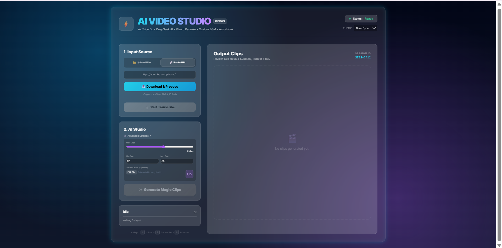

<div align="center">

<!-- ================= HERO ================= -->

# ⚡ AI VIDEO EDITOR STUDIO ⚡  
### _Cyberpunk AI Video Repurposing Engine_

> **Turn long videos into viral Shorts.**  
> Powered by AI. Rendered by FFmpeg. Built for domination.

<br/>


</div>

---

## 🖥️ SYSTEM INTERFACE (LIVE PREVIEW)

<p align="center">
  
</p>

---

## 🧠 WHAT IS THIS?

**AI Video Editor Studio** adalah **mesin auto-edit video berbasis AI**  
yang dirancang untuk **mengubah video panjang menjadi short-form content**  
tanpa workflow ribet, tanpa editing manual berjam-jam.

Ini **bukan editor biasa**.  
Ini **AI-powered video weapon**.

---

## 🎯 USE CASE

- Content creator (TikTok / Reels / Shorts)
- Podcast → clip viral
- Agency / tim konten
- Editing cepat + konsisten + scalable

---

## ⚙️ CORE FEATURES

### 🧠 AI BRAIN
- **Whisper** → speech-to-text
- **DeepSeek** → deteksi momen penting (hook, impact, emosi)
- **Qwen** → bantu narasi & konteks

### ✂️ AUTO CLIP ENGINE
- Potong momen terbaik otomatis
- Durasi short-friendly
- Skor kualitas tiap clip

### 🧩 SUBTITLE TIMELINE
- Edit subtitle per baris
- Kontrol start / end time
- Preview sebelum render

### 🔥 CYBER SUBTITLE (ASS)
- Subtitle cinematic
- Burn-in langsung ke video
- Tampilan modern / kinetic style

### 🎥 VIDEO PIPELINE
- Rendering via FFmpeg
- Output siap upload
- Stabil untuk produksi konten

---

## 🧬 WORKFLOW

```txt
UPLOAD VIDEO
     ↓
AI TRANSCRIBE
     ↓
AI DETECT MOMENTS
     ↓
AUTO CLIP
     ↓
SUBTITLE EDIT
     ↓
RENDER FINAL
     ↓
UPLOAD & DOMINATE
````

---

## 🏗️ PROJECT STRUCTURE

```txt
ai-video-editor/
│
├── app/
│   ├── api/
│   ├── core/
│   └── utils/
│
├── static/
│   └── index.html
│
├── storage/
│   ├── uploads/
│   ├── transcripts/
│   ├── clips/
│   ├── ass/
│   └── clips_subtitled/
│
├── dokumentasi/
│   └── contoh.png
│
├── main.py
├── requirements.txt
└── README.md
```

---

## 🛠️ INSTALLATION (LOCAL)

### 1️⃣ CLONE

```bash
git clone https://github.com/gempurbudianarki/ai-Clipper-vidio.git
cd ai-video-editor
```

### 2️⃣ VIRTUAL ENV

```bash
python -m venv venv
```

**Windows**

```bash
venv\Scripts\activate
```

**Linux / macOS**

```bash
source venv/bin/activate
```

### 3️⃣ DEPENDENCIES

```bash
pip install -r requirements.txt
```

---

## ⚠️ FFmpeg (MANDATORY)

Check:

```bash
ffmpeg -version
```

Install if missing:

**Windows**

* Download FFmpeg
* Add `ffmpeg/bin` to PATH

**Linux**

```bash
sudo apt install ffmpeg
```

**macOS**

```bash
brew install ffmpeg
```

> No FFmpeg = No Render = No Mercy.

---

## ▶️ RUN SERVER

```bash
uvicorn main:app --reload
```

Open:

```
http://127.0.0.1:8000
```

---

## 📦 OUTPUT ZONES

| Folder             | Function      |
| ------------------ | ------------- |
| `uploads/`         | Raw video     |
| `transcripts/`     | AI transcript |
| `clips/`           | Auto clips    |
| `ass/`             | Subtitle      |
| `clips_subtitled/` | Final output  |

---

## 📄 LICENSE

MIT License

---

<div align="center">

## 🧑‍💻 BUILT BY

# **GEMPUR BUDI ANARKI**

⚡ *AI is the tool.*
🔥 *Code is the weapon.*
🖤 *Content domination is the goal.*

</div>
